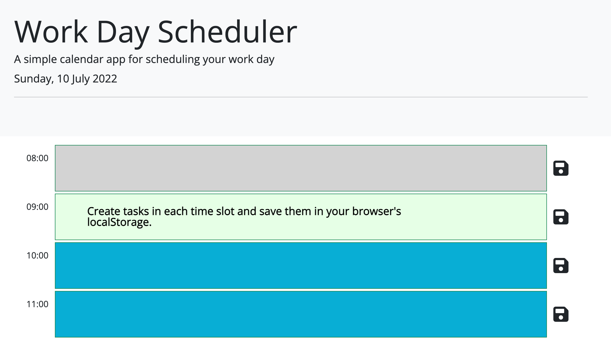

# Third-Party APIs Challenge: Work Day Scheduler
An assignment of the ESMT Coding Boot Camp. Apply your skills to create a simple calendar application. Use HTML, CSS, and JQuery as well as third-party APIs.
## Snapshot

## Special challenges
* Using jQuery
* New APIs: Google Fonts, Luxon (!Momentjs) and FontAwesome
* Improving design with Bootstrap 5
* Using nth child selector
* localStorage.setItem and localStorage.getItem
* jQuery .each() vs JavaScript for() loop

## Gratitude
* Andrew Evans of Rhythm and Binary for [Using Luxon for JavaScript Dates and Times](https://youtu.be/zIRSdTKyPS4)
* Morgan Roderick for general support and redirection from JavaScript to CSS for time highlighting
* ESMT Coding Boot Camp teachers and tutors for instruction, resource suggestions, and support
* Study buddies Henriette and Tornike for burning the midnight oil with me
## Contact
Tammi L. Coles  
URL of deployed application: https://tlcoles.github.io/05-Challenge-Scheduler/  
URL of the GitHub repository: https://github.com/tlcoles/05-Challenge-Scheduler  
